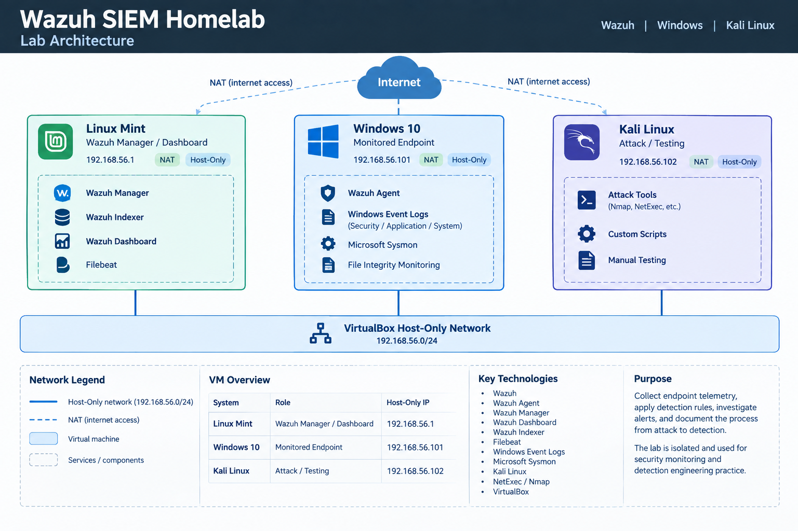

# Wazuh SIEM Homelab

A small security monitoring lab built with Wazuh, Windows, and Kali Linux.

The lab is used to simulate security activity in an isolated virtual environment, collect endpoint telemetry, build detections, and investigate the resulting alerts. The work is documented with configuration files, attack procedures, screenshots, and investigation notes.

## Architecture

The environment consists of three virtual machines connected through a VirtualBox Host-Only network.




| System     | Role                        | Host-Only IP     |
| ---------- | --------------------------- | ---------------- |
| Linux Mint | Wazuh Manager and Dashboard | `192.168.56.1`   |
| Windows 10 | Monitored endpoint          | `192.168.56.101` |
| Kali Linux | Attack and testing system   | `192.168.56.102` |

The Host-Only network is used for communication between the lab systems. The virtual machines may also have separate NAT interfaces for normal internet access.

## Components

### Wazuh Server

The Wazuh server runs on Linux Mint and provides:

* Wazuh Manager
* Wazuh Indexer
* Wazuh Dashboard
* Filebeat

The manager receives telemetry from the Windows endpoint, processes events through the Wazuh ruleset, and generates alerts for detected activity.

### Windows Endpoint

The Windows 10 virtual machine is the monitored endpoint.

The Wazuh Agent collects several sources of telemetry, including:

* Windows Security events
* Application events
* System events
* Microsoft Sysmon events
* File Integrity Monitoring data
* System inventory and security configuration data

### Kali Linux

Kali Linux is used as the testing system for generating controlled activity against the Windows endpoint.

Tools used in the lab include Nmap and NetExec, along with standard Linux utilities.

## Detection Approach

The project follows the event path from activity on the endpoint to the resulting Wazuh alert.

```text
Test Activity
     |
     v
Windows / Sysmon Event
     |
     v
Wazuh Agent
     |
     v
Wazuh Manager
     |
     v
Built-in Wazuh Rules
     |
     v
Custom Detection / Correlation
     |
     v
Wazuh Alert
     |
     v
Investigation
```

Where the built-in rules provide enough context, they are used directly. Custom rules are added when additional correlation or detection logic is required.

Custom Wazuh rules are kept separately from the default Wazuh ruleset.

## Attack Scenarios

Attack simulations are documented in the `attacks/` directory.

Each scenario focuses on a specific piece of activity and documents the relevant evidence and detection process.

Depending on the scenario, documentation may include:

* Attack setup and execution
* Source and destination systems
* Relevant Windows or Sysmon events
* Wazuh rule IDs
* Custom detection logic
* Alert details
* MITRE ATT&CK mapping
* Investigation findings
* Evidence screenshots
* Detection limitations

The scenarios are performed only against the virtual machines in this isolated lab.

## Detection Engineering

Detection-related configuration is kept under `detections/`.

The project uses Wazuh's existing rules as a starting point and adds local rules where the lab requires additional detection logic.

The intention is to keep detection rules:

* Specific enough to reduce unnecessary alerts
* Based on observable telemetry
* Reproducible in the lab
* Separate from the Wazuh default ruleset
* Documented together with the activity they detect

## Evidence

Evidence collected during testing is stored under `evidence/`.

Examples include:

* Terminal output from the attack system
* Windows event information
* Wazuh Dashboard alerts
* Alert JSON
* Rule details
* MITRE ATT&CK information
* Other relevant investigation data

Screenshots are kept with the corresponding attack scenario rather than collected in one large, unrelated directory.

## Repository Structure

```text
wazuh-siem-homelab/
│
├── README.md
├── LICENSE
│
├── architecture/
│   └── lab-architecture.png
│
├── attacks/
│   ├── ...
│   └── ...
│
├── detections/
│   ├── local_rules.xml
│   └── ...
│
├── evidence/
│   ├── ...
│   └── ...
│
└── docs/
    ├── installation.md
    ├── configuration.md
    └── troubleshooting.md
```

The structure will grow as additional attack scenarios and detections are added.

## MITRE ATT&CK

MITRE ATT&CK is used where it provides a useful description of the simulated adversary behavior.

Mappings are documented within the relevant attack and detection documentation rather than maintaining a separate list that would need to be updated every time the project changes.

## Scope

This is a controlled lab environment intended for security monitoring and detection engineering practice.

The attack simulations are performed against intentionally configured virtual machines on the isolated lab network. No testing is performed against systems outside the lab.

## Project Goals

The main focus of the lab is practical work with:

* SIEM monitoring
* Windows security telemetry
* Sysmon
* Wazuh agents and managers
* Wazuh detection rules
* Custom detection engineering
* Event correlation
* Security investigation
* MITRE ATT&CK
* Evidence collection
* Technical documentation
